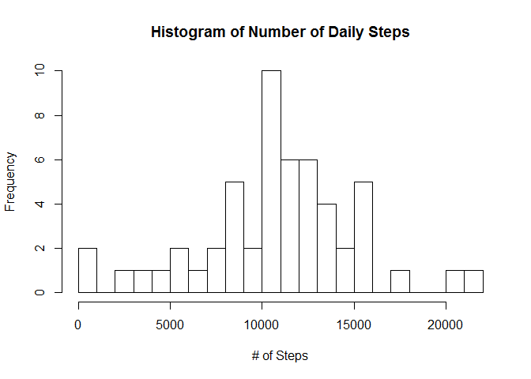

# Reproducible Research: Peer Assessment 1

### 
###  Student/Programmer:  Raymond C. Harris
###  Completed:           8/12/2017
###  Assignment GIT Repo: https://github.com/harrisr/RepData_PeerAssessment1
###  Code File:           PA1_template.Rmd
###

## Setup the environment


```r
library("data.table")
library("dplyr")
```

```
## 
## Attaching package: 'dplyr'
```

```
## The following objects are masked from 'package:data.table':
## 
##     between, first, last
```

```
## The following objects are masked from 'package:stats':
## 
##     filter, lag
```

```
## The following objects are masked from 'package:base':
## 
##     intersect, setdiff, setequal, union
```

```r
library("ggplot2")
library("chron")
rm(list = ls())


# when you run this code in your local environment, you would necessarily
# change this path to be what you want it to be ...

setwd("C:/myfiles/coursera_datasci/RepData_PeerAssessment1")
local_path = getwd()
local_path    #checkit
```

```
## [1] "C:/myfiles/coursera_datasci/RepData_PeerAssessment1"
```

```r
url <- "https://d396qusza40orc.cloudfront.net/repdata%2Fdata%2Factivity.zip"
download.file(url, file.path(local_path, "activity.zip"))
unzip(zipfile = "activity.zip")
```

## Loading and preprocessing the data


```r
#?read.csv

df_activity <- read.csv( "activity.csv",
              sep = ",",
              quote = "\"",
              header = TRUE,
              na.strings = "NA",
              colClasses = c("integer", "character", "integer"),
              stringsAsFactors = FALSE
              )
```


## What is mean total number of steps taken per day?


```r
## What is mean total number of steps taken per day?

# the detailed instructions say to do the following ::
#
# For this part of the assignment, you can ignore the missing values in the dataset.
# Calculate the total number of steps taken per day
# If you do not understand the difference between a histogram and a barplot, 
# research the difference between them.
# Make a histogram of the total number of steps taken each day
# Calculate and report the mean and median of the total number of steps taken per day

# before we calc the MEAN of the number of steps per day, we need to strip out the NAs

df_activity <- df_activity[ !is.na(df_activity$steps),  ]

summary(df_activity)
```

```
##      steps            date              interval     
##  Min.   :  0.00   Length:15264       Min.   :   0.0  
##  1st Qu.:  0.00   Class :character   1st Qu.: 588.8  
##  Median :  0.00   Mode  :character   Median :1177.5  
##  Mean   : 37.38                      Mean   :1177.5  
##  3rd Qu.: 12.00                      3rd Qu.:1766.2  
##  Max.   :806.00                      Max.   :2355.0
```

```r
head(df_activity)
```

```
##     steps       date interval
## 289     0 2012-10-02        0
## 290     0 2012-10-02        5
## 291     0 2012-10-02       10
## 292     0 2012-10-02       15
## 293     0 2012-10-02       20
## 294     0 2012-10-02       25
```

```r
str(df_activity)
```

```
## 'data.frame':	15264 obs. of  3 variables:
##  $ steps   : int  0 0 0 0 0 0 0 0 0 0 ...
##  $ date    : chr  "2012-10-02" "2012-10-02" "2012-10-02" "2012-10-02" ...
##  $ interval: int  0 5 10 15 20 25 30 35 40 45 ...
```

```r
#?as.Date()
# in order to use the plotting functions, must convert the date column
# to actually be DATEs

df_activity$date  <-as.Date(df_activity$date,"%Y-%m-%e")


# now we need to coagulate the counts of steps per day

df_activity_date_steps <- aggregate(steps ~ date, df_activity, FUN = sum)


# yup - i screwed this up.  i had to replace the barplot with a histogram.
# setting the # of breaks a little higher to show a little more granularity.
#?hist

hist(df_activity_date_steps$steps
     , xlab = "# of Steps"
     , main = "Histogram of Number of Daily Steps"
     , breaks = 20
)
```

<!-- -->

```r
avg_steps <- mean(df_activity_date_steps$steps)
median_steps <- median(df_activity_date_steps$steps)

avg_steps
```

```
## [1] 10766.19
```

```r
median_steps
```

```
## [1] 10765
```

## What is the average daily activity pattern?


```r
## What is the average daily activity pattern?

# the detailed instructions say to do the following ::
#
# Make a time series plot (i.e. type = "l") of the 5-minute interval (x-axis) 
# and the average number of steps taken, averaged across all days (y-axis)
# Which 5-minute interval, on average across all the days in the dataset, 
# contains the maximum number of steps?


#?aggregate

# now we need to coagulate the counts of steps per INTERVAL (using the MEAN function)

df_activity_interval_steps <- aggregate(steps ~ interval, df_activity, FUN = mean)

summary(df_activity_interval_steps)
```

```
##     interval          steps        
##  Min.   :   0.0   Min.   :  0.000  
##  1st Qu.: 588.8   1st Qu.:  2.486  
##  Median :1177.5   Median : 34.113  
##  Mean   :1177.5   Mean   : 37.383  
##  3rd Qu.:1766.2   3rd Qu.: 52.835  
##  Max.   :2355.0   Max.   :206.170
```

```r
head(df_activity_interval_steps)
```

```
##   interval     steps
## 1        0 1.7169811
## 2        5 0.3396226
## 3       10 0.1320755
## 4       15 0.1509434
## 5       20 0.0754717
## 6       25 2.0943396
```

```r
str(df_activity_interval_steps)
```

```
## 'data.frame':	288 obs. of  2 variables:
##  $ interval: int  0 5 10 15 20 25 30 35 40 45 ...
##  $ steps   : num  1.717 0.3396 0.1321 0.1509 0.0755 ...
```

```r
#?plot

plot(y = df_activity_interval_steps$steps
     , x = df_activity_interval_steps$interval
     , type = "l"
     , xlab = "Interval"
     , ylab = "Avg # Steps"
     , main = "Avg # of Steps Taken Per Interval (Avg Across All Days)"
     )
```

<!-- -->

```r
# just to take a gander at the data ...
df_activity_interval_steps[95:115, ]
```

```
##     interval     steps
## 95       750  57.84906
## 96       755  56.15094
## 97       800  73.37736
## 98       805  68.20755
## 99       810 129.43396
## 100      815 157.52830
## 101      820 171.15094
## 102      825 155.39623
## 103      830 177.30189
## 104      835 206.16981
## 105      840 195.92453
## 106      845 179.56604
## 107      850 183.39623
## 108      855 167.01887
## 109      900 143.45283
## 110      905 124.03774
## 111      910 109.11321
## 112      915 108.11321
## 113      920 103.71698
## 114      925  95.96226
## 115      930  66.20755
```

```r
#?which.max
interval_with_max_steps <- df_activity_interval_steps$interval[ which.max(df_activity_interval_steps$steps) ]

message("Interval with max # of steps")
```

```
## Interval with max # of steps
```

```r
interval_with_max_steps
```

```
## [1] 835
```


## Imputing missing values


```r
## Imputing missing values

# the detailed instructions say to do the following ::
#
# Note that there are a number of days/intervals where there are missing values (coded as NA). 
# The presence of missing days may introduce bias into some calculations or summaries of the data.
# Calculate and report the total number of missing values in the dataset (i.e. the total number #of rows with NAs)
# Devise a strategy for filling in all of the missing values in the dataset. 
# The strategy does #not need to be sophisticated. For example, you could use the mean/median for that day, 
# or the #mean for that 5-minute interval, etc.
# Create a new dataset that is equal to the original dataset but with the missing data filled #in.
# Make a histogram of the total number of steps taken each day and Calculate and report 
# the mean and median total number of steps taken per day. 
# Do these values differ from the estimates from the first part of the assignment? 
# What is the impact of imputing missing data on the estimates of the total daily number of steps?

df_activity <- read.csv( "activity.csv"
                         , sep = ","
                         , quote = "\""
                         , header = TRUE
                         , na.strings = "NA"
                         #, colClasses = c("integer", "numeric", "integer")
                         #, stringsAsFactors = TRUE
                         , stringsAsFactors = FALSE
)

total_rows_missing <- sum(is.na(df_activity$steps))
total_rows_missing
```

```
## [1] 2304
```

```r
head(df_activity, 10)
```

```
##    steps       date interval
## 1     NA 2012-10-01        0
## 2     NA 2012-10-01        5
## 3     NA 2012-10-01       10
## 4     NA 2012-10-01       15
## 5     NA 2012-10-01       20
## 6     NA 2012-10-01       25
## 7     NA 2012-10-01       30
## 8     NA 2012-10-01       35
## 9     NA 2012-10-01       40
## 10    NA 2012-10-01       45
```

```r
# https://www.r-bloggers.com/example-2014-5-simple-mean-imputation/

df_activity_filled <- df_activity

df_activity_filled$steps[is.na(df_activity_filled$steps)] = mean(df_activity_filled$steps, na.rm=TRUE)

head(df_activity_filled, 10)
```

```
##      steps       date interval
## 1  37.3826 2012-10-01        0
## 2  37.3826 2012-10-01        5
## 3  37.3826 2012-10-01       10
## 4  37.3826 2012-10-01       15
## 5  37.3826 2012-10-01       20
## 6  37.3826 2012-10-01       25
## 7  37.3826 2012-10-01       30
## 8  37.3826 2012-10-01       35
## 9  37.3826 2012-10-01       40
## 10 37.3826 2012-10-01       45
```

```r
# alternative
# df_activity_filled <- transform(df_activity, steps = ifelse(is.na(steps), mean(steps, na.rm=TRUE), steps))
#df_activity_filled


#?as.Date()
# in order to use the plotting functions, must convert the date column
# to actually be DATEs

df_activity_filled$date  <-as.Date(df_activity_filled$date,"%Y-%m-%e")


# now we need to coagulate the counts of steps per day

df_activity_filled_date_steps <- aggregate(steps ~ date, df_activity_filled, FUN = sum)


# yup - i screwed this up.  i had to replace the barplot with a histogram.
# setting the # of breaks a little higher to show a little more granularity.
#?hist

hist(df_activity_filled_date_steps$steps
     , xlab = "# of Steps"
     , main = "Histogram of Number of Daily Steps"
     , breaks = 20
)
```

<!-- -->

```r
head(df_activity_filled_date_steps, 10)
```

```
##          date    steps
## 1  2012-10-01 10766.19
## 2  2012-10-02   126.00
## 3  2012-10-03 11352.00
## 4  2012-10-04 12116.00
## 5  2012-10-05 13294.00
## 6  2012-10-06 15420.00
## 7  2012-10-07 11015.00
## 8  2012-10-08 10766.19
## 9  2012-10-09 12811.00
## 10 2012-10-10  9900.00
```

```r
avg_steps_filled <- mean(df_activity_filled_date_steps$steps)
median_steps_filled <- median(df_activity_filled_date_steps$steps)

avg_steps_filled
```

```
## [1] 10766.19
```

```r
median_steps_filled
```

```
## [1] 10766.19
```

```r
diff_avg_steps_filled  <- abs(avg_steps_filled - avg_steps) / avg_steps
diff_median_steps_filled  <- abs(median_steps_filled - median_steps) / median_steps

diff_avg_steps_filled
```

```
## [1] 0
```

```r
diff_median_steps_filled
```

```
## [1] 0.0001104207
```

```r
message("There is hardly any impact due to imputing the MEAN over top of missing values")
```

```
## There is hardly any impact due to imputing the MEAN over top of missing values
```


## Are there differences in activity patterns between weekdays and weekends?


```r
## Are there differences in activity patterns between weekdays and weekends?

# the detailed instructions say to do the following ::
#
# For this part the weekdays() function may be of some help here. 
# Use the dataset with the filled-in missing values for this part.
# Create a new factor variable in the dataset with two levels - "weekday" and "weekend" 
# indicating whether a given date is a weekday or weekend day.
# Make a panel plot containing a time series plot (i.e. type = "l") of the 
# 5-minute interval (x-axis) and the average number of steps taken, 
# averaged across all weekday days or weekend days (y-axis). 
# See the README file in the GitHub repository to see an example of what this plot 
# should look like using simulated data.


#https://stackoverflow.com/questions/26441700/how-to-determine-if-date-is-a-weekend-or-not-not-using-lubridate

df_activity_weekdays  <- df_activity_filled
df_activity_weekdays$weekday <- weekdays(df_activity_weekdays$date)
df_activity_weekdays$daytype <- factor(ifelse(df_activity_weekdays$weekday %in% c("Saturday", "Sunday"), "weekend", "weekday"))

head(df_activity_weekdays, 10)
```

```
##      steps       date interval weekday daytype
## 1  37.3826 2012-10-01        0  Monday weekday
## 2  37.3826 2012-10-01        5  Monday weekday
## 3  37.3826 2012-10-01       10  Monday weekday
## 4  37.3826 2012-10-01       15  Monday weekday
## 5  37.3826 2012-10-01       20  Monday weekday
## 6  37.3826 2012-10-01       25  Monday weekday
## 7  37.3826 2012-10-01       30  Monday weekday
## 8  37.3826 2012-10-01       35  Monday weekday
## 9  37.3826 2012-10-01       40  Monday weekday
## 10 37.3826 2012-10-01       45  Monday weekday
```

```r
# now we need to coagulate the counts of steps per weekday/weekend daytype

df_activity_weekdays_date_steps <- aggregate(steps ~ interval + daytype, df_activity_weekdays, FUN = mean)

head(df_activity_weekdays_date_steps, 10)
```

```
##    interval daytype    steps
## 1         0 weekday 7.006569
## 2         5 weekday 5.384347
## 3        10 weekday 5.139902
## 4        15 weekday 5.162124
## 5        20 weekday 5.073235
## 6        25 weekday 6.295458
## 7        30 weekday 5.606569
## 8        35 weekday 6.006569
## 9        40 weekday 4.984347
## 10       45 weekday 6.584347
```

```r
# facets =  . ~ daytype  makes the plot panels appear side-by-side
#           the example in the "readme" said it wanted them on top of each other...

qplot(interval
      , steps
      , data=df_activity_weekdays_date_steps
      , facets = daytype ~ .
      , geom = "line"
)
```

<!-- -->
